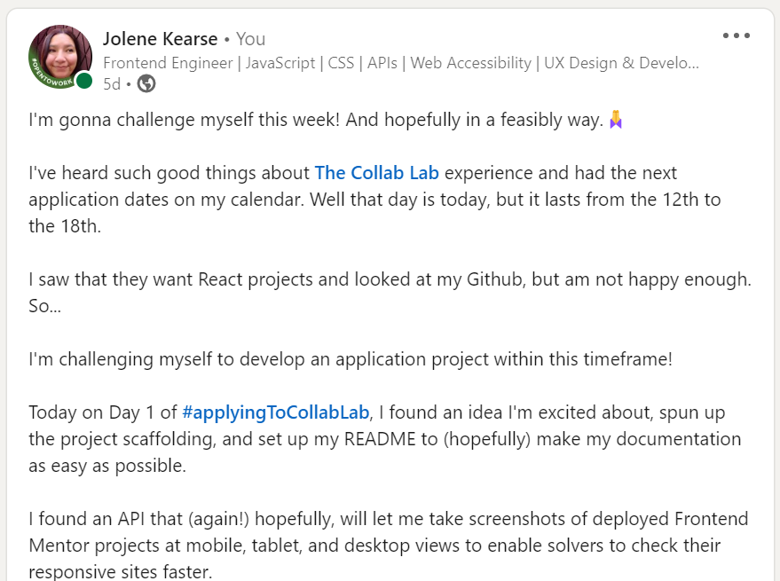
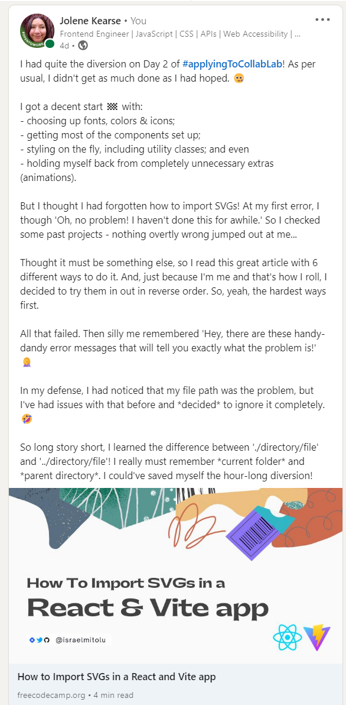
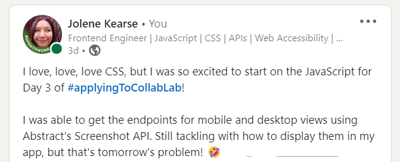
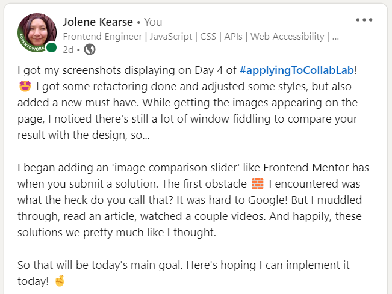
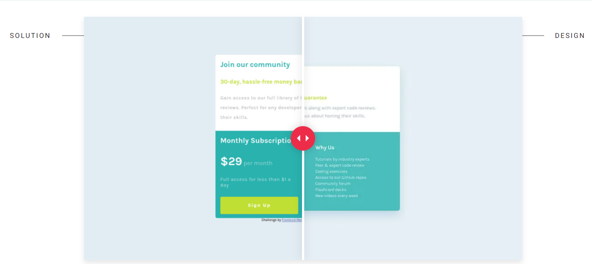
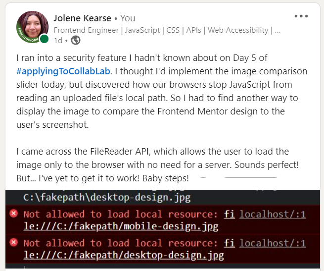
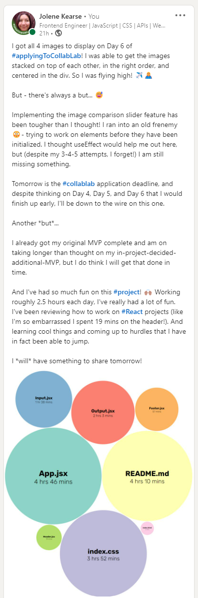

# Welcome to my **Frontend Mentor Tester**!!!!!!!

Hello, 你好, 안녕하세요, Hola, Hallo, Bonjour!

Why the 7 exclamation points, you ask?

Well, this is my **application project** for **[The Collab Lab](https://the-collab-lab.codes/)**.  I began this project on March 12 and the deadline is March 18, so _7 excited exclamations for 7 days_! ✨

<hr>

## Table of Contents 📜
- [Links 🔗](https://github.com/JoleneKearse/frontend-mentor-tester#links-)
- [Screenshots 📸](https://github.com/JoleneKearse/frontend-mentor-tester#screenshots-)
- [Deciding on the project 📔](https://github.com/JoleneKearse/frontend-mentor-tester#deciding-on-the-project-)
- [Built with 🛠️](https://github.com/JoleneKearse/frontend-mentor-tester#built-with-%EF%B8%8F)
- [My journey 🎢](https://github.com/JoleneKearse/frontend-mentor-tester#my-journey-%EF%B8%8F)
  - [Day 1 🏁1️⃣](https://github.com/JoleneKearse/frontend-mentor-tester#day-1-1%EF%B8%8F%E2%83%A3)
  - [Day 2 🏁2️⃣](https://github.com/JoleneKearse/frontend-mentor-tester#day-2-2%EF%B8%8F%E2%83%A3)
  - [Day 3 🏁3️⃣](https://github.com/JoleneKearse/frontend-mentor-tester#day-3-3%EF%B8%8F%E2%83%A3)
  - [Day 4 🏁4️⃣](https://github.com/JoleneKearse/frontend-mentor-tester#day-4-4%EF%B8%8F%E2%83%A3)
  - [Day 5 🏁5️⃣](https://github.com/JoleneKearse/frontend-mentor-tester#day-5-5%EF%B8%8F%E2%83%A3)
  - [Day 6 🏁6️⃣](https://github.com/JoleneKearse/frontend-mentor-tester#day-6-6%EF%B8%8F%E2%83%A3)
  - [Day 7 🏁7️⃣](https://github.com/JoleneKearse/frontend-mentor-tester#day-7-7%EF%B8%8F%E2%83%A3)
- [What I reviewed 📓](https://github.com/JoleneKearse/frontend-mentor-tester#what-i-reviewed-)
- [What I learned 👩🏽‍🎓](https://github.com/JoleneKearse/frontend-mentor-tester#what-i-learned-)
- [Resources 📑](https://github.com/JoleneKearse/frontend-mentor-tester#resources-)
- [About me 🤪](https://github.com/JoleneKearse/frontend-mentor-tester#about-me-)
- [Contact me 📯](https://github.com/JoleneKearse/frontend-mentor-tester#contact-me-)

<hr>

### Links 🔗

<hr>

### Screenshots 📸


<hr>

### Deciding on the project 📔

With applications open I could finally see the [application](https://airtable.com/shrv9cqaTVHNhCvT1) requirements.  **React projects are prioritized**. 

Cool... until I do a quick scan of my [Github](https://github.com/JoleneKearse).  I've focused on other things these past couple months, including:
- SvelteKit,
- DSAs,
- Python, and
- Finally **submitting** Frontend Mentor challenges.

And all my React projects are quite old! 

So strange that my _meandering learning_ affected how many React projects I continued doing. 🤣  

Anyway, I decide to do one **awesome-sauce project to showcase my skills**.  

But, what to do?

Well, early, early this morning I listened to the **Self-Taught Devs** podcast featuring one of my favourite **LinkedIn** connections.  She was talking about choosing her _showcase project_ and how she searched through a list of **free API's** for inspiration.

Well, a React project needs dynamic content, at least if you want to use one of it's **super-powers**! 💪 So, yeah, an API...

But, hmmm, which one can I use to solve a problem.  🤔

Lately I've been doing **Frontend Mentor Challenges** to speed up production and reacquaint myself with one of my greatest loves, **CSS**.  ❤️  The given designs always include **mobile** & **desktop** screenshots to imitate.  

I've been using this great **[Chrome extension: Viewport Resizer](https://chrome.google.com/webstore/detail/viewport-resizer-%E2%80%93-respon/kapnjjcfcncngkadhpmijlkblpibdcgm?hl=en)**. It gives quick access to Frontend Mentor's **375px width**, but you have to fiddle with the custom desktop width of **1440px**.  Like, it's really not a _big_ deal, but I'd love a tool to _automatically_ flip between these target viewports.

So I was happy to find **[Abstract's Screenshot API](https://app.abstractapi.com/api/screenshot/documentation)**! 💡

I loved this for 3 reasons 💖:
1) Screenshots are so useful for development,
2) You could customize the sizes; and
3) The docs said it'd return clear error codes.

<hr>

### Built with 🛠️
-  to re-render only the changed sections.
-  to scaffold and bundle my project.
-  for its super-speed.
-  to challenge myself & because it is reported to be faster.
-  for the nuts and bolts code.
-  to make it all wonderfully beautiful & pleasing to use.
-  for version code.
-  to showcase my code.

### My journey 🎢

<hr>

#### Day 1 🏁1️⃣



I searched out **free APIs** to use and land on an awesome one I can use in a React project to solve a problem I've encountered - and I'm sure others have as well. 🕺🏼

With an exciting idea & API in tow, I begin...

I start my first couple hours by:
1) _Happily_, remembering (without looking up) how to scaffold a React project using **Vite** and **Yarn** in the **CLI**;
2) Deciding to say _C'est la vie_ and go with the `JavaScript + SWC` option;
3) Starting the *README**; and
4) Holding myself accountable, by posting on [LinkedIn](https://www.linkedin.com/in/jolene-kearse-2562ba218/)

#### Day 2 🏁2️⃣



Today I cleaned up the boilerplate and worked on the design on the fly!

1) I use **DevTools** to determine the fonts used and add the **Google Fonts** links.
2) Set up site colors using **custom properties**.
3) Create my Header and Footer components.
4) Have quite a time of it remembering how to import SVGs.


#### Day 3 🏁3️⃣



Today I finally got into **JavaScript**!  I worked on the endpoints for my API calls.

#### Day 4 🏁4️⃣



Woohoo! I successfully used the API to display my screenshots on the page.  So I had finished my **MVP** for this project, but...

I noticed some UX improvements are needed.

While I could compare my project's screenshot to the design image, it took more fiddling with windows and apps than I'd like to subject my users to!

So I found a new _MVP_! I wanted a **Design Comparison** like on Frontend Mentor! 



Like that would be so awesome before you submit your solution!

#### Day 5 🏁5️⃣



I figured out what was needed to get this working:
- a way to upload the images
- placing them in the same space with the user's screenshot on top
- a way to 'slide' the user's image aside to easily compare the two.  

I ran into my first **cool new thing to learn** on this project: Browsers have a security feature to prevent JavaScript from accessing users' local file paths. Certainly sounds reasonable, although it meant I'd have to find another way to upload the Frontend Mentor provided design image to compare with the user's result.  

I discovered [the `FileReader` API](https://blog.logrocket.com/using-filereader-api-preview-images-react/) as a work around.

#### Day 6 🏁6️⃣



Today was awesome! I:
- got all 4 images to display
- got them correctly stacked & centered

But... Oh no!

The **image comparison** was much harder than I had thought! 

I had researched it yesterday, then tried to code it on the fly to no avail. I returned to two articles I had read, and 1 & a half videos - also a no-go! 

So I freely admit I turned to **ChatGPT**. Of course, every answer had little issues with it, but I love using it as an assistant when coding by myself. After reviewing its' spit out code, there is often a mistake you can point out and have it re-generate. Also you need to have the **right leading questions**. 

#### Day 7 🏁7️⃣

I got my **MVP+** working! 🎉 I have some additional UX changes to make and didn't get most of my _cool, but time intensive_ design choices implemented.

But, wow!, I am so happy with what I've been able to do in a week!!!

Today I got my **image comparison slider** working. Yes, at first it was just re-sizing the user's images above the Frontend Mentor designs, but I re-iterated until I had it working like on Frontend Mentor itself!

I also had a first, my Vercel deploy failed!

<hr>

### What I reviewed 📓

- ##### Just how to set up a project 😕

I noticed _just how long_ it had been since I spun up a React project using Vite and Yarn! I had to spend a little bit with my fingers on the keyboard in the CLI, thinking: _"What's that command, again?"_

Thankfully I remembered a time spent coding with my group, where we were joking around about it.

But, yes, `yarn create vite` still works!

Unfortunately, I hate to cheat on...

- ##### Initializing a Github repo

I do remember another fun time, when my three teammates and I tried recalling the exact CLI commands and order to initialize a repo...  Good times! I did have to cheat though, as I got `git remote add origin <SSH key>` in the wrong order, necessitating a second go!

- ##### Writing good commit messages 

In my excitement and haste, I forgot to label my git commits correctly!

[Writing better commit messages](https://medium.com/swlh/writing-better-commit-messages-9b0b6ff60c67)

- ##### Getting correct file paths

I gave myself an unnecessarily hard time importing SVG images, because **I forgot how file paths work**!  🤣  

Initially I used a simple img tag after importing it: 
```jsx
import IconGithub from './assets/icon-github.svg'
...

```
Unfortunately I got an **error** at the file path.  I checked out some of my prior projects and even went through the options in [this article](https://www.freecodecamp.org/news/how-to-import-svgs-in-react-and-vite/#:~:text=Importing%20SVGs%20using%20the%20image,supports%20it%20off%20the%20bat.).  

So, yep, research is good, but know what's even better?

Actually reading the error message!

I'd have saved myself about an hour if I'd _really_ considered my file path in the first place.  I know this is one of my trouble spots! 

I was trying to access a file in my `assets` directory from within`/components`, so I needed to come out of one folder, up a level, then back into another, so all I had needed was another period/dot!


Since I've had this issue so many times before, I took the time to remind myself of two things:
1) `.` means the **current directory**, while
2) `..` is the **parent directory**.

<hr>

### What I learned 👩🏽‍🎓

TBA

<hr>

### Resources 📑

[The Collab Lab](https://the-collab-lab.codes/) is this super-cool organization offering this opportunity.

[Chrome extension: Viewport Resizer](https://chrome.google.com/webstore/detail/viewport-resizer-%E2%80%93-respon/kapnjjcfcncngkadhpmijlkblpibdcgm?hl=en) is the best free resource I had found to quickly test your responsive projects in different device sizes.

[Abstract's Screenshot API](https://app.abstractapi.com/api/screenshot/documentation) shows the (quite good) documentation for my chosen API.

[Writing better commit messages](https://medium.com/swlh/writing-better-commit-messages-9b0b6ff60c67) is a great reminder on commit messages.

[How to Import SVGs in a React and Vite app](https://www.freecodecamp.org/news/how-to-import-svgs-in-react-and-vite/#:~:text=Importing%20SVGs%20using%20the%20image,supports%20it%20off%20the%20bat.) provides 6 ways to do it.  The first worked in my case - of course I did start in reverse order! 🤣 

[Using the `FileReader` API to preview images in React](https://blog.logrocket.com/using-filereader-api-preview-images-react/) is an easy to understand guide to display user uploaded images to a page.

[How to Measure JavaScript Execution Time](https://dev.to/saranshk/how-to-measure-javascript-execution-time-5h2#:~:text=The%20easiest%20way%20to%20track,the%20difference%20of%20the%20two.) was my introduction to the Console's time methods.

<hr>

### About me 🤪

Hiya! 👋 My name is **Jolene Kearse**, a Canadian who identifies as a **forever expat**.

I am a 41-old-year old Native American transitioning into tech.  I was an **English as a Foreign Language Teacher** ️🌏🧑‍🏫 for over 15 years - _so, yeah, for a little bit_ 🤌... I lived all over the world, including China, England & South Korea.

Now I'm a proud, **self-taught Software Engineer**!!!

I'm also proud of how far I came in 2022. **I finally learned JavaScript**! 🍻 _I had struggled for about a year before I finally could add that to my skillset. If you're interested in an awesome 🔥 course check out [Class Central's Bootcamp YouTube Playlist going through freeCodeCamp's Algorithms and Data Structures Certification](https://www.youtube.com/playlist?list=PLU3RKvMpgrSEoqVIV14K_zuinrIBcnCgT).

Then I met an awesome group of fellow-learning devs, **The Explorers**. This exposed me to the myriad and oft-confusing ways of using **Git** in a team - loving it now! But also projects using so many kinds of tech that would've just blown my mind a year before 🤯 including:

- React
- TypeScript
- Tailwind

I even participated in **[#Hacktoberfest](https://hacktoberfest.com/)** and earned the coveted T-shirt! 🎉👕

But who cares about 2022? This is 2023!

...

I've been taking so many courses to learn **Backend Development** and **navigate the process of earning my first tech job**!

One of those courses has seen me going back to **Python** - which I had treated as my _crutch language_ to understand JavaScript. 

_(I hadn't found an engaging JS course at that point and heard how close Python was to natural language.)_

I've been taking a **DSA** course that uses Python, and just had to laugh how things have come full-circle.  I was a bit fuzzy on the teacher's Python code until she translated it to JS for all of us curly braces lovers! 🤣 

Another challenge I am undertaking this year is [Exercism's](https://exercism.org/) **#12in23**. This is a cool 😎 opportunity to try out 12 different languages this year. Each month has a theme, like **Functional February** and **Mechanical March** to encourage you to check out different language paradims. I'm loving this chance to dip my toe in other types of programming. 

<hr>

### Contact me 📯

I'd love ❤️ to connect with y'all (_sorry, I love using that ironicallly and do so with great frequency_ 😜):
- [LinkedIn](https://www.linkedin.com/in/jolene-kearse-2562ba218/)
- [Github](https://github.com/JoleneKearse)
- [Twitter](https://twitter.com/FromJolene)